# テスト駆動開発(国際通貨)を写経する

t_wadaさんが、テスト駆動開発の写経を勧めていたので、PHPで写経してみます。

https://twitter.com/t_wada/status/1334561597

## Open shell

```bash
docker-compose run --rm php_cli bash
```

## Diagrams

各章の時点でのクラス図の記録です。自作ツールのphp-class-diagramで出力しています。

### 第1部

#### 第1章 仮実装

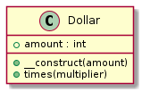

#### 第2章 明白な実装


#### 第3章 三角測量

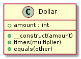

#### 第4章 意図を語るテスト

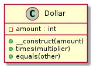

#### 第5章 原則をあえて破るとき

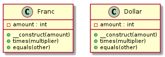

#### 第6章 テスト不足に気づいたら

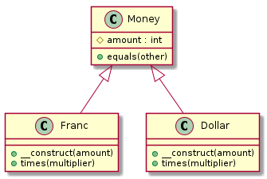

#### 第7章 疑念をテストに翻訳する


#### 第8章 実装を隠す

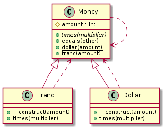

#### 第9章 歩幅の調整

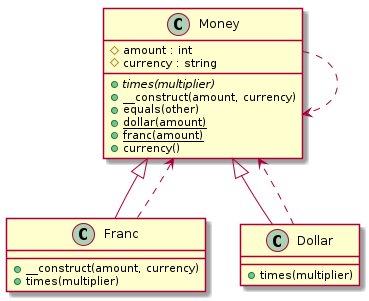

#### 第10章 テストに聞いてみる

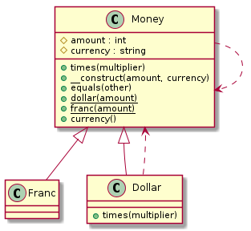

#### 第11章 不要になったら消す


#### 第12章 設計とメタファー

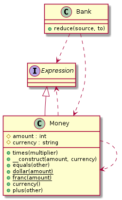

#### 第13章 実装を導くテスト

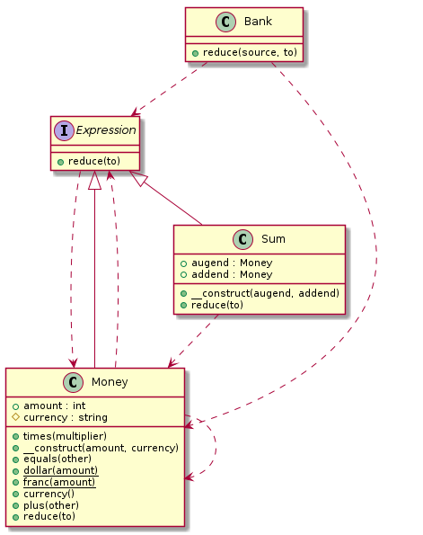

#### 第14章 学習用テストと回帰テスト

PHPでは連想配列のキーにObjectを指定することができなかったので、RateResolverを追加してMapの替わりとしました。

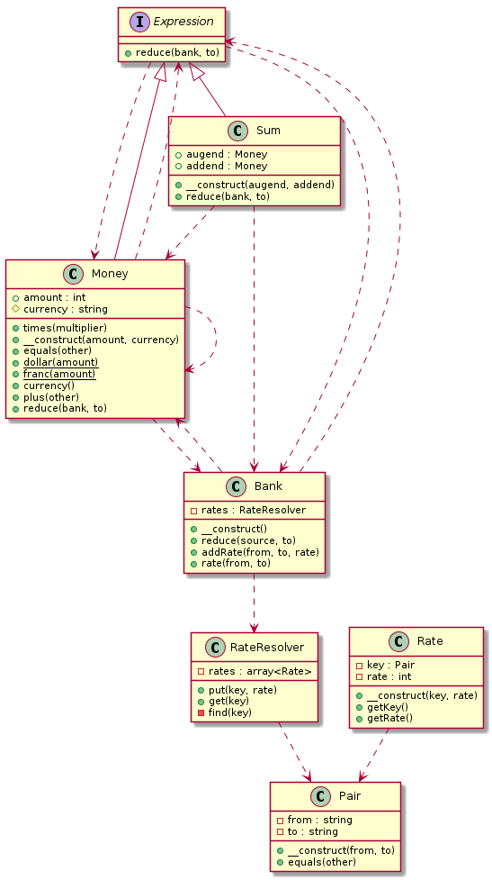

#### 第15章 テスト任せとコンパイラ任せ

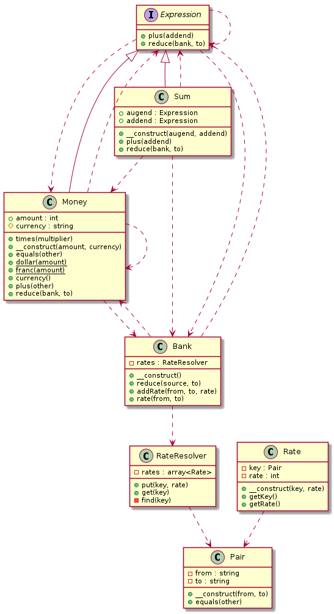

#### 第16章 将来の読み手を考えたテスト

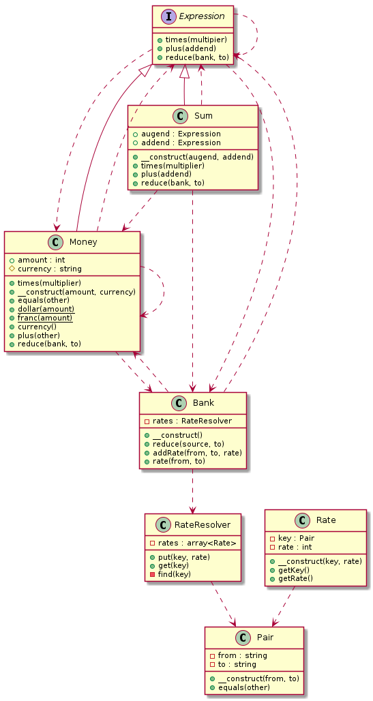
