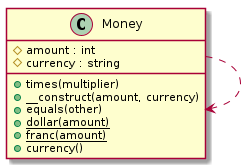

# テスト駆動開発を写経する

t_wadaさんが、テスト駆動開発の写経を勧めていたので、PHPで写経してみます。

https://twitter.com/t_wada/status/1334561597

## Open shell

```bash
docker-compose run --rm php_cli bash
```

## Diagrams

各章の時点でのクラス図の記録です。自作ツールのphp-class-diagramで出力しています。

### chapter 1


### chapter 2


### chapter 3


### chapter 4


### chapter 5


### chapter 6


### chapter 7


### chapter 8


### chapter 9


### chapter 10


### chapter 11


